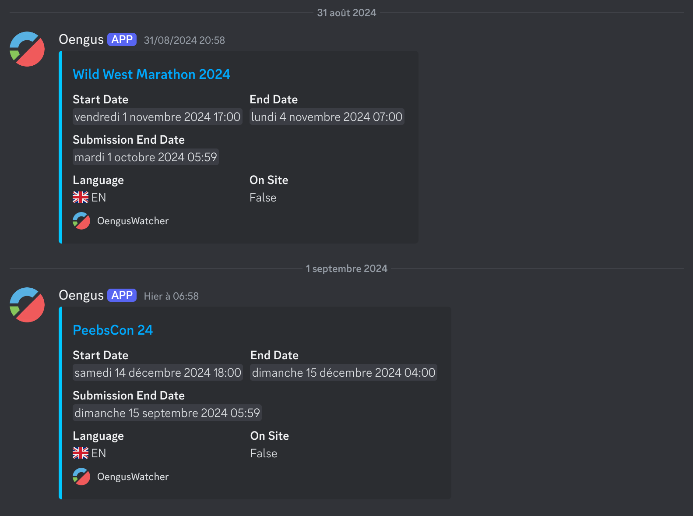

# OengusWatcher



> A simple discord notification webhook for new marathons on Oengus

## Features

Want to discover and participate in new speedrun marathons but don't want to check the Oengus website regularly? OengusWatcher is the solution!

This software can watch for new marathons and send a message in a discord channel using a webhook to notify users. A few informations are sent in the message and the link allows to open the marathon page directly.

## Self-Hosting

The is no public instance of this software hosted at the moment so you will need to host it yourself to get it to work. I will consider making a public instance if there is any demand for it.

### Requirements

- [Docker](https://www.docker.com/) or the [.Net SDK](https://dotnet.microsoft.com/en-us/download) _(if you want to build from source)_ installed
- A working and accessible [Redis](https://redis.io/) instance with [persistence enabled](https://redis.io/docs/latest/operate/oss_and_stack/management/persistence/) _(can be hosted locally or in a Docker container)_
- A [Discord Webhook](https://support.discord.com/hc/en-us/articles/228383668-Intro-to-Webhooks) to the channel you want messages to be sent

### Using Docker

Here is an example of the compose file that can be used to host this software. There is no need for any path mapping or exposing ports as Redis is used to store all the required data.

```yml
services:
  oengus-watcher:
    image: eveldee/oengus-watcher:latest
    container_name: oengus-watcher
    restart: unless-stopped
    
    environment:
      OengusWatcher__RedisConnectionString: "my.redis.host:6379"
      OengusWatcher__DiscordWebHook: "Paste Discord Webhook here"
      
version: '3'
```

If you don't have any Redis database instance already available, you can host one using Docker and this compose file:

```yml
services:
  redis:
    image: redis:alpine
    container_name: redis
    restart: unless-stopped
    
    command: redis-server --save 60 1 --loglevel warning
    
    ports:
      - 6379:6379
      
    volumes:
      - "/docker/redis:/data"

version: '3'
```

### Manually (build from source)

To build and run the service from source, a few steps are required:
- Clone this repository and make sure .Net 8.0 SDK is installed
- Set the Redis and Discord Webhook options using either [app secrets](https://learn.microsoft.com/en-us/aspnet/core/security/app-secrets#secret-manager) _(recommended)_ or [environment variables](https://learn.microsoft.com/en-us/dotnet/core/extensions/configuration-providers#environment-variable-configuration-provider) _(same names as for the docker hosting)_
- Use the command `dotnet run` inside the project folder *(where `OengusWatcher.csproj` is located)*
- This will build and run the service, errors will show up if you incorrectly configured the Redis and Webhook options

Alternatively, it is possible to build the docker image using the `docker-publish.sh` script.

## Used libraries

This save editor tool couldn't be made without these awesome libraries and tools:
- [Discord.Net](https://github.com/discord-net/Discord.Net) - *licensed under the MIT license*
- [StackExchange.Redis](https://github.com/StackExchange/StackExchange.Redis) - *licensed under the MIT license*

## Licence

*This software is licensed under the [MIT license](LICENSE), you can modify and redistribute it freely as long as you respect the respective [Used libraries](#used-libraries) licenses*